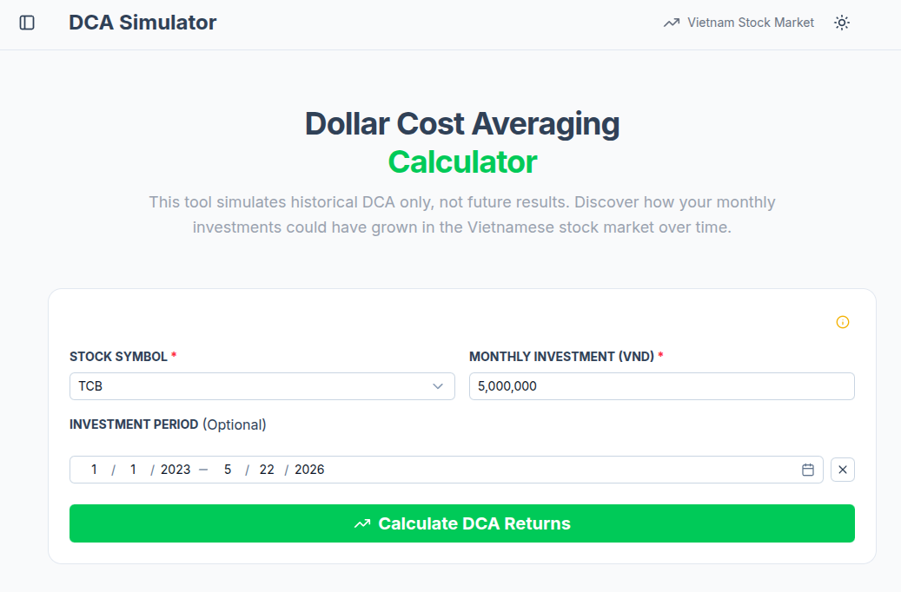
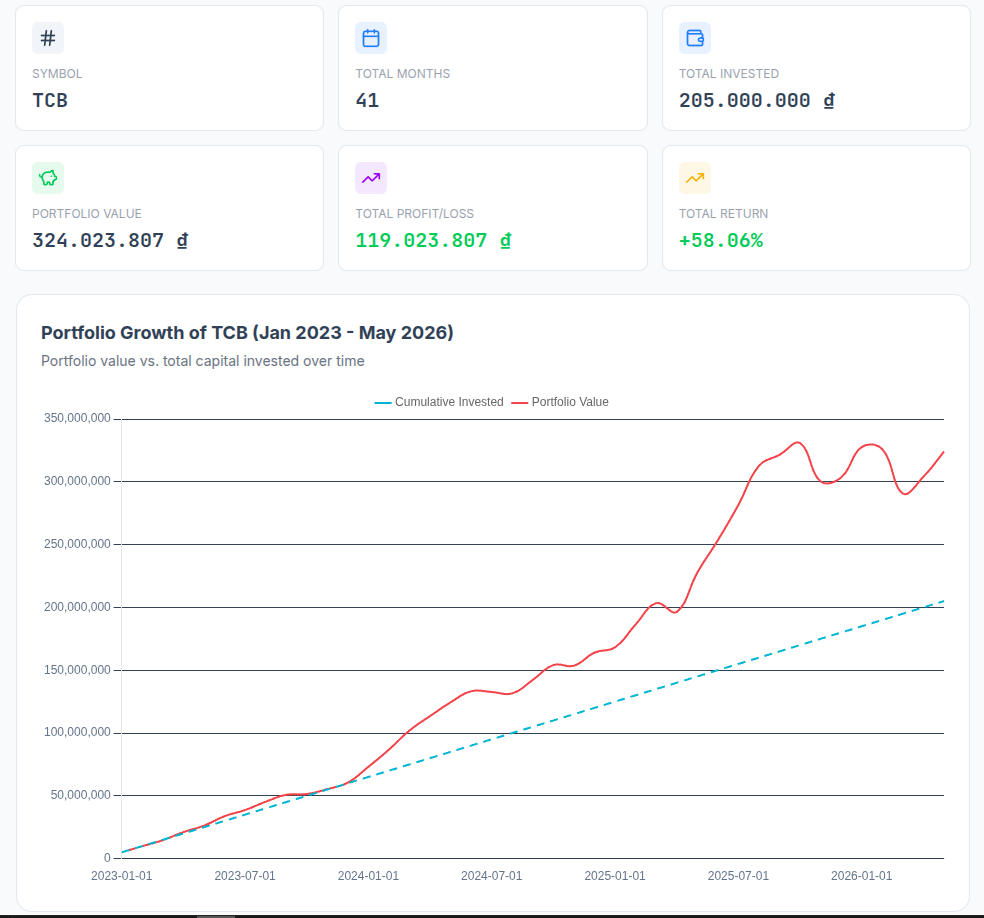
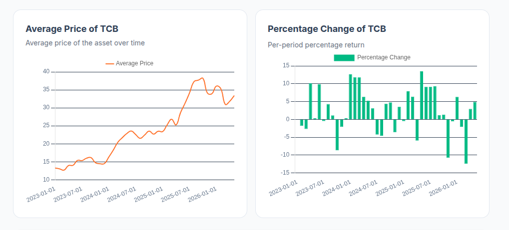
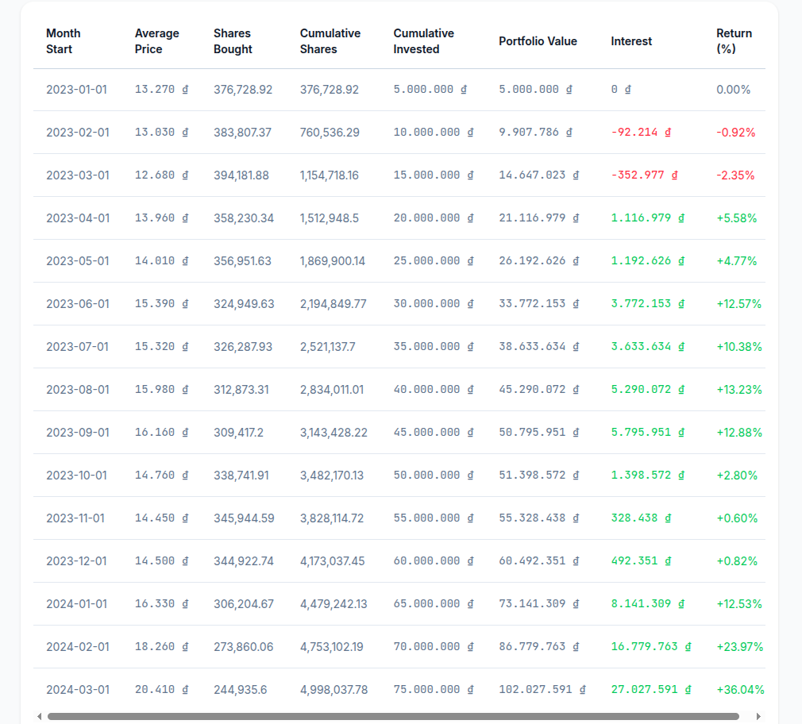
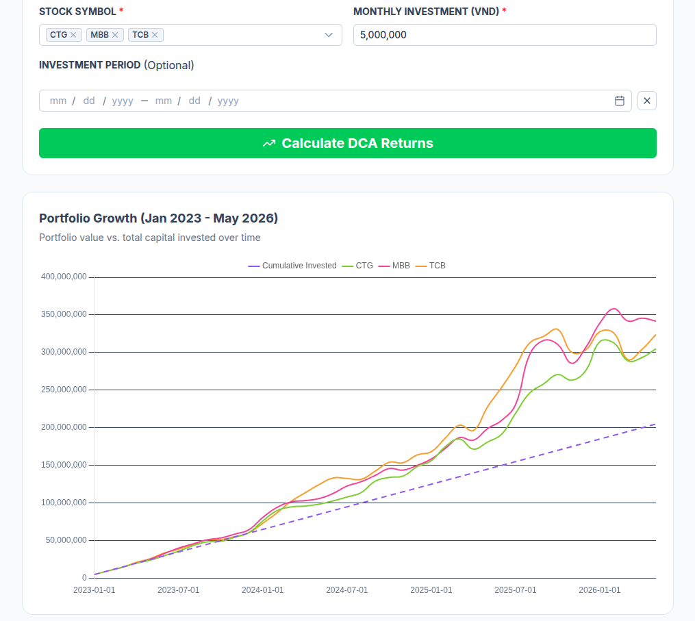
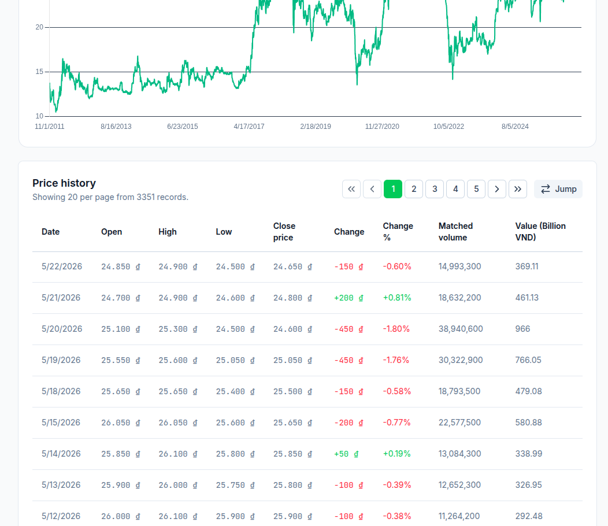
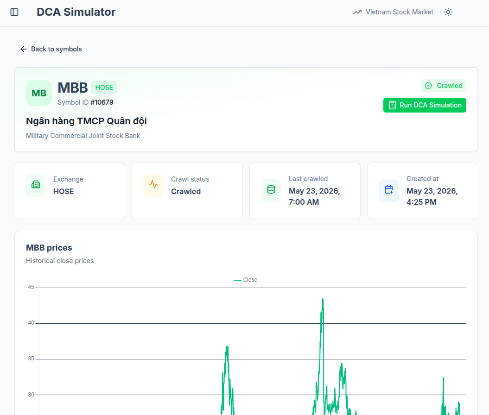
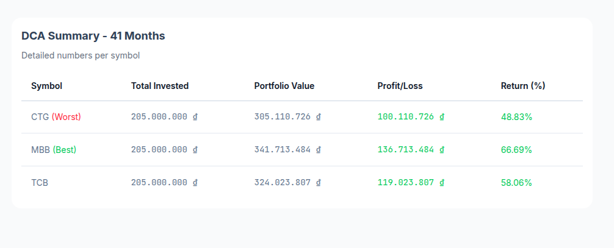

# Dollar-Cost Averaging (DCA) Simulation Platform

Welcome to the **DCA (Dollar-Cost Averaging) Simulation Platform** repository. This project is a comprehensive tool designed to simulate and visualize the performance of Dollar-Cost Averaging investment strategies against historical market data (such as stocks and financial assets). It allows users to simulate investment scenarios, analyze performance metrics (total invested, current portfolio value, percentage returns), and compare DCA outcomes against alternative strategies like lump-sum investing.

---

## 🚀 Key Features

- **Interactive DCA Simulator**: Input investment amounts, start/end dates, and analyze simulated performance.
- **Background Worker Processing**: Heavy simulation computations and stock market data crawling are managed asynchronously using Celery and RabbitMQ.
- **Data Persistence**: Uses PostgreSQL for system metadata, and integrates DuckDB for fast analytics on historical financial time-series data.
- **Modern Web Interface**: Responsive and visual dashboard to input parameters and interact with dynamic asset performance charts.

---

## 📸 Screenshots & Dashboard Gallery

Here are screenshots showcasing the DCA Simulation Platform, its interactive charting interfaces, and the detailed performance metrics it provides:

<p align="center">
  
</p>

<p align="center">
  
  
</p>

<p align="center">
  
  
</p>

<p align="center">
  
  
</p>

<p align="center">
  
</p>

---

## 🛠️ Architecture & Services

The platform is containerized using Docker Compose and consists of the following services:

| Service Name | Docker Image | Description |
| :--- | :--- | :--- |
| **`web`** | `manhtuongnguyen/dca-simulation-web` | Frontend user interface. Served on a configurable port. |
| **`backend`** | `manhtuongnguyen/dca-simulation-backend` | Django ASGI server running with Gunicorn + Uvicorn to serve fast REST APIs. |
| **`celery_worker`** | `manhtuongnguyen/dca-simulation-backend` | Handles background symbol ingestion, historical data crawling, and heavy computations. |
| **`db`** | `postgres:16-alpine` | PostgreSQL database for structured meta-data and core models. |
| **`redis`** | `redis:7-alpine` | Ultra-fast caching and background task coordination storage. |
| **`rabbitmq`** | `rabbitmq:3.13-management` | Message broker routing simulation and crawling tasks to Celery workers. |

---

## 🔌 How to Customize Ports (Avoiding Port Conflicts)

To prevent conflicts with other services running on your local machine, **all host port mappings have been externalized** into the `.env` configuration file. 

> [!IMPORTANT]
> **Do not modify the internal container ports.** The backend host port `8069` is statically hardcoded within the frontend application to route API requests. You can freely change all other host ports (PostgreSQL, Web, Redis, RabbitMQ) to resolve local port conflicts.

### Step-by-Step Port Update Guide

1. **Open the Configuration File**:
   Locate and open the `.env` file in the root of your project directory.

2. **Modify the Host Ports**:
   Find the **Customizable Host Ports** section in `.env` and adjust the values of the variables to any unused port numbers on your host machine:

   ```env
   # Database Port Mapping
   DB_PORT=5432                         # Change if port 5432 is in use by a local PostgreSQL

   # Services Host Port Configuration
   BACKEND_HOST_PORT=8069               # Keep as 8069 (unless your environment supports routing backend traffic differently)
   WEB_HOST_PORT=3069                   # Change if port 3069 is occupied
   REDIS_HOST_PORT=6379                 # Change if port 6379 is occupied
   RABBITMQ_MANAGEMENT_HOST_PORT=15672  # Change if port 15672 is occupied
   RABBITMQ_AMQP_HOST_PORT=5672         # Change if port 5672 is occupied
   ```

3. **Restart the Application**:
   Once you have updated the ports in your `.env` file, apply the changes by recreating and starting your containers:
   ```bash
   # Stop and clean up existing containers
   docker compose down

   # Start the platform in background mode
   docker compose up -d
   ```

4. **Verify Port Mappings**:
   To ensure your containers are successfully running on the newly configured host ports, execute:
   ```bash
   docker compose ps
   ```

---

## 🚀 Running the Application

To start the application locally with a single command:

1. Copy .env file
```
cp .env.example .env
```

2. Update the host ports in the `.env` file as needed to avoid conflicts with other services on your machine.
3. Run the services
```bash
docker compose up -d
```
4. Access the web interface at `http://localhost:3069` (or your configured `WEB_HOST_PORT`).

### Useful Management Commands

- **Check logs of all services**:
  ```bash
  docker compose logs -f
  ```
- **Check logs for a specific service** (e.g., backend):
  ```bash
  docker compose logs -f backend
  ```
- **Stop and remove container volumes**:
  ```bash
  docker compose down -v
  ```
