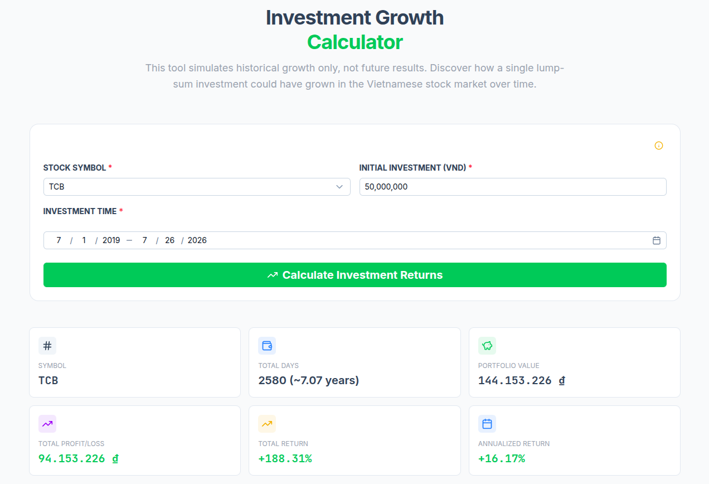
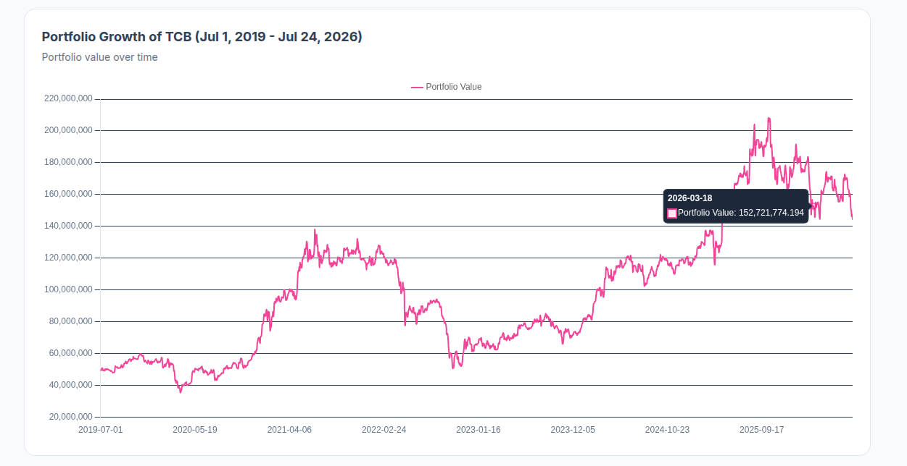
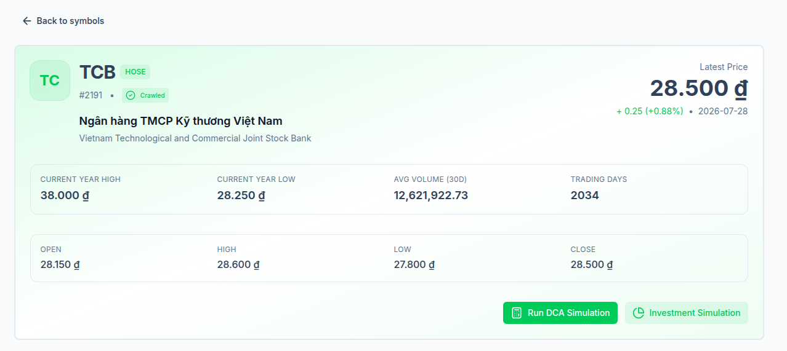
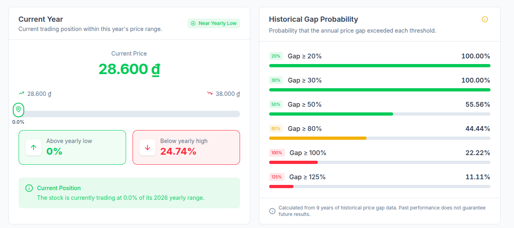
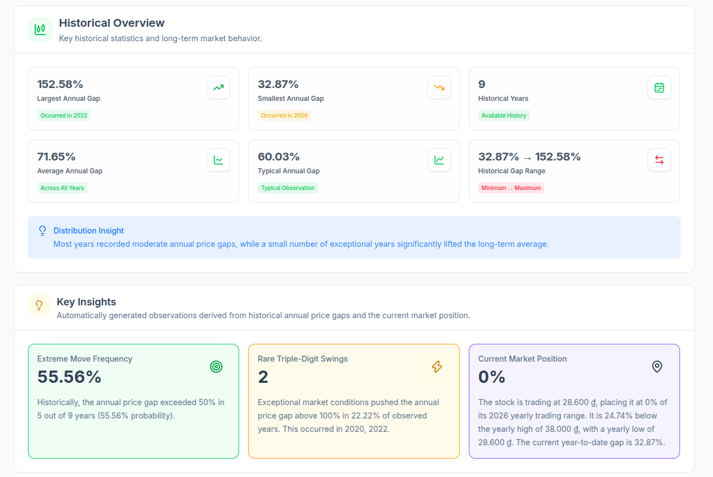

# Dollar-Cost Averaging (DCA) Simulation Platform

Welcome to the **DCA (Dollar-Cost Averaging) Simulation Platform** repository. This project is a comprehensive tool designed to simulate and visualize the performance of Dollar-Cost Averaging investment strategies against historical market data (such as stocks and financial assets). It allows users to simulate investment scenarios, analyze performance metrics (total invested, current portfolio value, percentage returns), and compare DCA outcomes against alternative strategies like lump-sum investing.

---

## 🚀 Key Features

- **Gold Price Tracking & Analytics**: Access and analyze historical gold price trends alongside stock market data.
- **Gold & Asset Calculators**: Evaluate investment returns with dedicated Lump-Sum and DCA (Dollar-Cost Averaging) calculators.
- **Interactive DCA Simulator**: Input investment amounts, start/end dates, and analyze simulated portfolio performance.
- **Investment Growth Simulator**: Model lump-sum investments to project growth and compound interest over time.
- **Background Worker Processing**: Heavy simulation computations and financial data crawling are managed asynchronously using Celery and RabbitMQ.
- **Data Persistence & Analytics**: Powered by PostgreSQL for metadata and DuckDB for ultra-fast queries on historical time-series data.
- **Modern & Mobile-Optimized UI**: Fully responsive visual dashboard with dynamic asset charts, accessible seamlessly on desktop and mobile devices at [https://www.marketlab.space](https://www.marketlab.space).

---

## [v0.1.4] - 2026-08-07

### Added
* **Gold Price History:** Added historical price data tracking for Gold.
* **Gold Calculator:** Introduced a Gold investment calculator with support for both Lump-Sum and DCA (Dollar-Cost Averaging) strategies.
* **Custom Domain:** The platform is now officially accessible via [https://www.marketlab.space](https://www.marketlab.space).

### Improvements
* **Mobile UI:** Enhanced user interface and responsiveness for mobile devices.

### Bug Fixes
* **General:** Resolved various known bugs and improved overall system stability and performance.

## [v0.1.3] - 2026-07-28

### Bug Fixes
* **Price Data:** Resolved an issue where crawling prices resulted in missing data.
* **General:** Fixed various minor bugs and improved overall system stability.

### Updates & Breaking Changes
* **Deployment / Infrastructure:** Users must run `docker compose down -v`, then `docker compose up -d` again to apply the latest updates.
* **Cache & Storage:** Users must clear their browser cache and local storage upon entering the front page to ensure proper application behavior.

## [v0.1.2] - 2026-07-26

### Bug Fixes
* **Symbol Data:** Fixed an issue where the application could not retrieve symbol list data.
* **General:** Resolved various minor bugs and improved overall system stability.

### New Features
* **Investment Growth:** Added the lump-sum investment growth calculator.

### Updates
* **Symbol Detail:** Redesigned and updated the symbol detail page for a better user experience.

---

## 📸 Screenshots & Dashboard Gallery

Here are screenshots showcasing the DCA Simulation Platform, its interactive charting interfaces, and the detailed performance metrics it provides:

<p align="center">
  
</p>

<p align="center">
  
  
</p>

<p align="center">
  
  
</p>

<p align="center">
  
  
</p>

<p align="center">
  
  
</p>

<p align="center">
  
  
</p>

<p align="center">
  
</p>

---

## 🛠️ Architecture & Services

The platform is containerized using Docker Compose and consists of the following services:

| Service Name | Docker Image | Description |
| :--- | :--- | :--- |
| **`web`** | `manhtuongnguyen/dca-simulation-web` | Frontend user interface. Served on a configurable port. |
| **`backend`** | `manhtuongnguyen/dca-simulation-backend` | Django ASGI server running with Gunicorn + Uvicorn to serve fast REST APIs. |
| **`celery_worker`** | `manhtuongnguyen/dca-simulation-backend` | Handles background symbol ingestion, historical data crawling, and heavy computations. |
| **`db`** | `postgres:16-alpine` | PostgreSQL database for structured meta-data and core models. |
| **`redis`** | `redis:7-alpine` | Ultra-fast caching and background task coordination storage. |
| **`rabbitmq`** | `rabbitmq:3.13-management` | Message broker routing simulation and crawling tasks to Celery workers. |

---

## 🔌 How to Customize Ports (Avoiding Port Conflicts)

### Step-by-Step Port Update Guide

1. **Open the Configuration File**:
   Locate and open the `.env` file in the root of your project directory.

2. **Modify the Host Ports**:
   Find the **Customizable Host Ports** section in `.env` and adjust the values of the variables to any unused port numbers on your host machine:

   ```env
   WEB_HOST_PORT=3069                   # Change if port 3069 is occupied
   ```

3. **Restart the Application**:
   Once you have updated the ports in your `.env` file, apply the changes by recreating and starting your containers:
   ```bash
   # Stop and clean up existing containers
   docker compose down

   # Start the platform in background mode
   docker compose up -d
   ```

4. **Verify Port Mappings**:
   To ensure your containers are successfully running on the newly configured host ports, execute:
   ```bash
   docker compose ps
   ```

---

## 🚀 Running the Application

To start the application locally with a single command:

1. Copy .env file
```
cp .env.example .env
```

2. Update the host ports in the `.env` file as needed to avoid conflicts with other services on your machine.
3. Run the services
```bash
docker compose up -d
```
4. Access the web interface at `http://localhost:3069` (or your configured `WEB_HOST_PORT`).

### Useful Management Commands

- **Check logs of all services**:
  ```bash
  docker compose logs -f
  ```
- **Check logs for a specific service** (e.g., backend):
  ```bash
  docker compose logs -f backend
  ```
- **Stop and remove container volumes**:
  ```bash
  docker compose down -v
  ```
